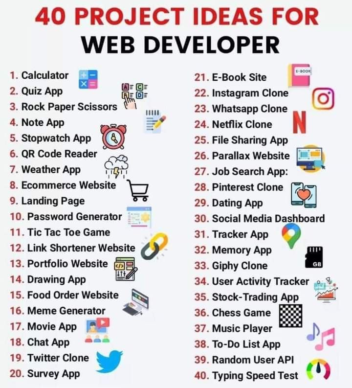

# FULL-STACK-ROADMAP

Thanks for visiting my GitHub account!

A full-stack web developer is a person who can develop both client and server software.

**In addition to mastering HTML and CSS, he/she also knows how to:**

- Program a browser (e.g. using JavaScript, jQuery, Angular, or Vue)
- Program a server (e.g. using PHP, ASP, Python, or Node)
- Program a database (e.g. using SQL, SQLite, or MongoDB) [see-more](https://www.w3schools.com/whatis/whatis_fullstack.asp)

## Advantages

The advantage of being a full-stack web developer is:

- You can master all the techniques involved in a development project
- You can make a prototype very rapidly
- You can provide help to all the team members
- You can reduce the cost of the project
- You can reduce the time used for team communication
- You can switch between front- and back-end development based on requirements
- You can better understand all aspects of new and upcoming technologies

## Disadvantages

- The solution chosen can be wrong for the project
- The solution chosen can be dependent on developer skills
- The solution can generate a key person risk
- Being a full stack developer is increasingly complex

## SOURCE CODE (Download)

[Click Here](https://mega.nz/folder/RGFiUApD#PoKIVCwF8IkQhE2PHw1XxQ)

## FEATURES

|                                                  |
| :----------------------------------------------: |
|              FULL-STACT-DEVELOPMENT              |
|  |
|                                                  |
| :----------------------------------------------: |
|                FULL-STACT-ROADMAP                |
|                    |

|                                           |                                                  |
| :---------------------------------------: | :----------------------------------------------: |
|            FULL-STACT-ROADMAP             |                 Web Design & Dev                 |
|  |  |

|                                     |                                    |
| :---------------------------------: | :--------------------------------: |
|             WEB-PROJECT             |                USES                |
|  |         |
|        |        |
|  |  |
|  |  |

## Follow Me

 [Facebook](http://facebook.com/learnwithfair),  [Youtube](http://youtube.com/@learnwithfair),  [Instagram](http://instagram.com/learnwithfair)
